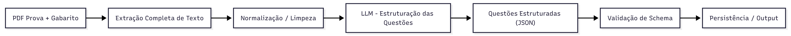

# Exam Extraction Pipeline

Este projeto implementa um **pipeline de extração e estruturação de exames em PDF**, com foco em provas de múltipla escolha (ENEM, vestibulares, concursos, etc.).

O objetivo principal é transformar **PDFs de provas e gabaritos** em um **formato JSON estruturado**, preservando:

- imagens associadas às questões,
- textos de apoio,
- referências bibliográficas,
- enunciados,
- alternativas,
- alternativas corretas,
- metadados do exame.

Na raiz do projeto, você encontrará o arquivo [`expected_output.json`](expected_output.json), que demonstra o formato final esperado do output JSON.

## Funcionalidades

- **Extração de Texto**
  - Extração robusta de texto de PDFs
  - Suporte a intervalos de páginas
  - Normalização de conteúdo

- **Extração de Imagens**
  - Extração e filtragem de imagens relevantes
  - Filtros por tamanho, proporção, cores e repetição

- **Extração de Exames**
  - Leitura do PDF da prova e do gabarito
  - Associação de imagens às questões corretas

- **Estruturação de Questões**
  - Conversão do texto bruto em JSON estruturado
  - Padronização de identificadores (`QUESTÃO XX`)
  - Extração de alternativas, resposta correta e fontes

- **Validação Determinística**
  - Schema bem definido (Pydantic)
  - Pós-processamento e enriquecimento de dados
  - Controle total do output final

## Diagrama do Fluxo de Trabalho



## Tecnologias Utilizadas

- **Langchain**: Para integração com o modelo de linguagem e gerenciamento de prompts.
  - `langchain`
  - `langchain-core`
  - `langchain-google-genai`
- **fitz (PyMuPDF)**: Para extração de texto de PDFs e manipulação de imagens.

### Por que PyMuPDF?

**PyMuPDF (fitz)**: Escolhida para extração de texto e imagens com maior controle e performance. Permite filtrar imagens por características (tamanho, proporção, cores), extraindo apenas conteúdo potencialmente relevante. Oferece velocidade superior na extração de texto e manipulação geral de imagens.

## Estrutura do Projeto

```plaintext
.
├── data                            # Pasta para armazenar PDFs de entrada
│   └── exemplo.pdf
├── img
│   └── flow_pipeline.png
├── src
│   ├── extractors/                 # Módulos de extração (texto, imagens, exames)
│   ├── models/                     # Modelos de dados (Pydantic)
│   ├── processors/                 # Processadores de texto e questões
│   ├── utils/                      # Utilitários (ex: carregar modelo)
│   ├── config.py                   # Configurações do sistema
│   ├── pipeline.py                 # Ponto de entrada principal da aplicação
│   └── prompts.py                  # Prompts do sistema
├── expected_output.json            # Exemplo do output JSON esperado
├── pyproject.toml                  # Definições do projeto e dependências
└── README.md

```

## Instalação

1.  **Clone o repositório**:

    ```bash
    git clone https://github.com/luis-otavio-dias/exam-extraction-pipeline.git
    cd data-extraction-agent
    ```

2.  **Dependências**:
    - **Com UV**  
      O projeto usa uv para gerenciar dependências. Se você utiliza uv, execute no diretório do projeto:

      ```bash
      uv sync
      ```

    - **Alternativa sem UV**
      - Crie e ative um ambiente virtual:

        ```bash
        python -m venv .venv
        source .venv/bin/activate
        # No Windows: .venv\Scripts\activate
        ```

      - Instale as dependências:

        ```bash
        pip install -e .
        ```

3.  **Configure as variáveis de ambiente**:
    Crie um arquivo `.env` copiando o `.env-example` e adicione sua chave de API:

    ```bash
    cp .env-example .env
    ```

    Em seguida, edite o arquivo `.env`:

    ```ini
    AI_MODEL_API_KEY="sua_chave_de_api_aqui"
    ```

## Execução do Pipeline

```bash
  uv run --env-file=".env" src/pipeline.py
```

Durante a execução, o pipeline seguirá os seguintes passos:

1.  Extrair o conteúdo da prova e do gabarito dos PDFs.
2.  Normalizar o conteúdo textual.
3.  Segmentar o texto em questões individuais.
4.  Associar imagens extraídas às questões corretas.
5.  Estruturar cada questão em um formato JSON.
6.  Validar e salvar o output final.

## Exemplo de Saída

```json
[
  {
    "question": "Questão 5",
    "image": false,
    "images": [],
    "passage_text": "A França é um país localizado na Europa Ocidental...",
    "sources": [
      "https://pt.wikipedia.org/wiki/Fran%C3%A7a"
    ],
    "statement": "Identifique a capital política e cultural mencionada no texto.",
    "options": {
      "A": "Londres",
      "B": "Berlim",
      "C": "Paris",
      "D": "Madri",
      "E": "Roma"
    },
    "correct_option": "C"
  },
  ...
]
```

## Racional por trás da arquitetura do pipeline

### **Por que não usar um agente LLM autônomo?**

Inicialmente, neste projeto foi experimentado uma arquitetura baseada em agentes usando LangChain/LangGraph, onde um LLM coordenava múltiplas ferramentas (extração de texto, extração de imagens, estruturação de questões). No entanto, o agente não tinha autonomia real. A abordagem e as ferramentas a serem utilizadas eram estritamente definidas em um system prompt que guiava linearmente o fluxo de trabalho do agente, em vez de permitir decisões dinâmicas, invalidando o propósito de um agente autônomo.  
Após uma avaliação arquitetural, essa abordagem foi substituída por um **pipeline determinístico** com orquestração explícita em código.

### **Justificativa do design**

O workflow para o processamento dos exames é totalmente conhecido e determinístico:

- Extrair texto
- Normalizar conteúdo
- Estruturar questões
- Validar output

Como o fluxo de controle é previsível, usar um agente autônomo introduziu complexidade desnecessária, maior latência e menor capacidade de depuração.

### **Abordagem atual**

O sistema agora segue um pipeline linear, onde:

- A lógica de negócios e orquestração são gerenciadas pelo código da aplicação.

- A LLM é usada para transformação semântica (texto -> JSON estruturado) e para inferência de informações (exame, ano, área).

- Toda a validação e persistência são realizadas de forma determinística

### **Benefícios dessa abordagem**

- Melhoria na observabilidade e depuração

- Menor custo e latência

- Versionamento de prompts mais fácil e evolução do schema

- Separação clara de responsabilidades

### **Observabilidade e depuração**

Cada etapa do pipeline pode ser inspecionada de forma isolada:

- texto extraído
- chunks de questões
- respostas da LLM
- validação final

Isso permite identificar falhas com precisão.
